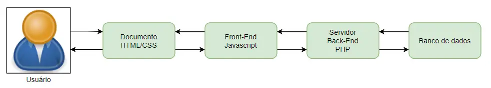
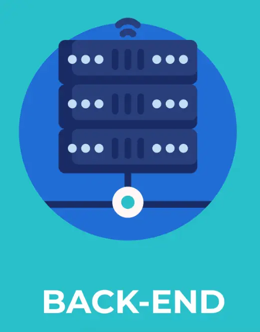
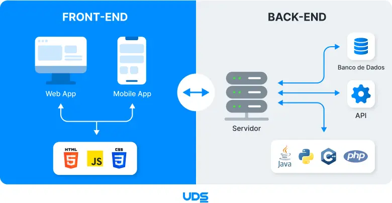

<!-- _class: lead -->

# Programação Web I
## Introdução aos conceitos de Front-end e Back-end

Prof. Pablo Werlang
pablowerlang@ifsul.edu.br

---

# Introdução

- Reúne diversos conceitos:
  - Front-end (Executa na máquina do usuário)
  - Back-end (Executa em um servidor remoto / na nuvem)
- Desenvolveremos aplicações para Web de ponta-a-ponta

<div class="media flex items-end h-full">
    
</div>

---

# Introdução
## Front-end

<div class="grid grid-cols-3">
<div class="col-span-2">

- Executa na máquina do usuário (navegador)
- Estrutura do Documento — **HTML**
- Aparência do documento/aplicação — **CSS**
- Interação com o usuário e lógica da aplicação local — **JavaScript**
- Permite a construção de interfaces ricas e interativas
- Não requer consulta aos dados armazenados em um servidor externo

</div>

<div>
    <div class="media ml-auto">
        
    </div>
</div>
</div>

---

# Introdução
## Back-end

<div class="grid grid-cols-3">
<div class="col-span-2">

- Executa em um servidor remoto / na nuvem
  - Fluxo dos dados e lógica da aplicação central
  - Armazenamento das informações
- Se comunica com aplicações, não com pessoas **(API)**
  - Recebe informações (requisições)
  - Lógica do sistema
  - Se comunica com banco de dados
  - Entrega dados estruturados **(JSON)**

</div>

<div>
    <div class="media ml-auto">
        
    </div>
</div>
</div>

---

# Introdução
## Front-end e Back-end

<div class="media size-full">
    
</div>

---

<!-- _class: divider -->

# Separação de Conceitos

---

# Separação de Conceitos
## Cada arquivo com uma finalidade

<div class="grid grid-cols-2">
<div>

**HTML** — Estrutura inicial do documento

```html
<!DOCTYPE html>
<html lang="pt-BR">
<head>
  <link rel="stylesheet" href="style.css">
  <script src="script.js" defer></script>
</head>
<body>
  <h1>Hello World!</h1>
</body>
</html>
```

</div>
<div>

**JS** — Lógica que é aplicada ao documento

```javascript
console.log('Hello World!');
```

**CSS** — Como o documento se parece

```css
h1 {
    color: red;
}
```
</div>

</div>

---

# Separação de Conceitos
## Usando `defer`

```html
<script src="script.js" defer></script>
```

- O navegador baixa o script sem travar toda a leitura do HTML
- A execução fica para depois que o documento terminar de ser montado
- Isso evita o clássico erro de tentar acessar um elemento que ainda nem apareceu na página
- É uma boa escolha para scripts tradicionais, quando você não precisa de módulos

---

# Separação de Conceitos
## JavaScript moderno com `type="module"`

```html
<script type="module" src="script.js"></script>
```

- Diz ao navegador que o arquivo JS é um módulo
- Permite usar `import` e `export`
- Cada arquivo pode ter uma responsabilidade mais clara
- Não permite abrir os arquivos diretamente no navegador, precisa de um servidor local (ex: [Live Server](https://marketplace.visualstudio.com/items?itemName=ritwickdey.LiveServer) do VSCode)

```js
import { somar } from './calc.js';
console.log(somar(2, 3));
```