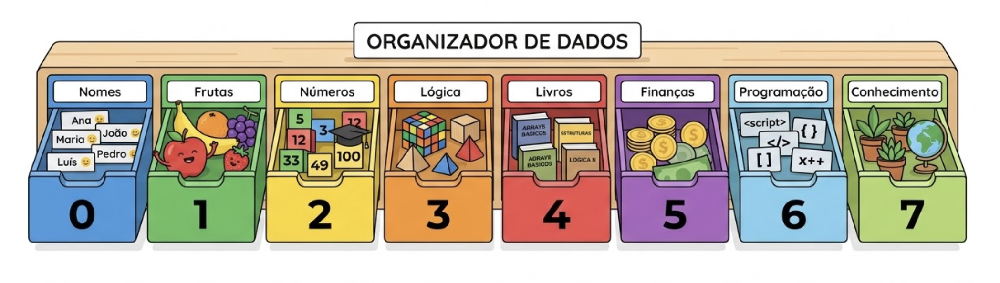
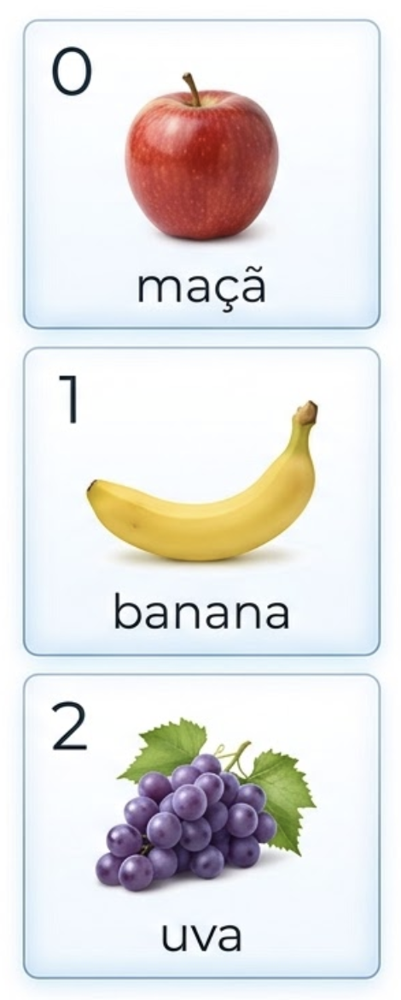
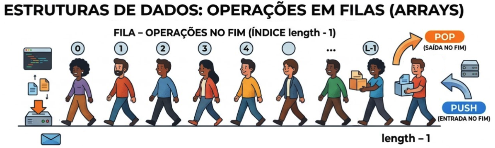
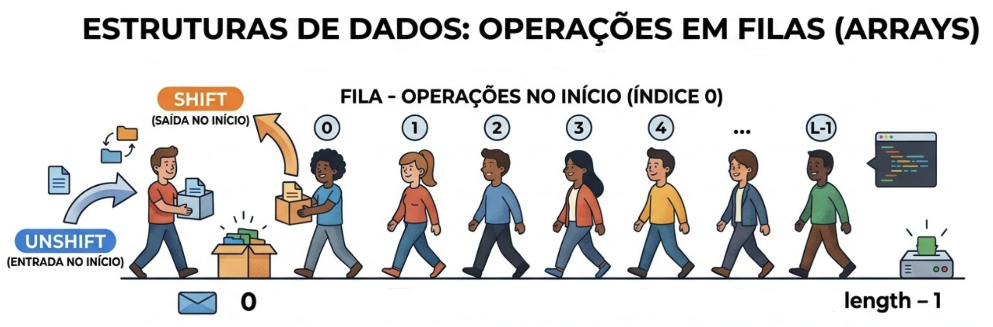

<!-- _class: lead -->

# Programação Web I
## Arrays em JavaScript

Prof. Pablo Werlang
pablowerlang@ifsul.edu.br

---

# Arrays em JavaScript
## Para que isso serve na prática?

- Guardar vários valores em uma única estrutura
- Atualizar listas, buscas, filas e resumos na tela
- Percorrer dados sem criar variáveis soltas até o fim dos tempos
- Preparar terreno para DOM, objetos, fetch e APIs

<div class="media mx-auto">
    
</div>

---

# Arrays em JavaScript
## Roteiro da aula

- O que é um array e como pensar em índices
- Operações mais comuns do dia a dia
- Laços e métodos para percorrer, filtrar e transformar
- Relação entre array e interface
- Erros comuns e práticas da seção

---

<!-- _class: divider -->

# Conceito Base

---

# Arrays em JavaScript
## O que é um array?

```js
const nomes = ['Ana', 'Bruno', 'Carla'];
```

- É uma estrutura para guardar **vários valores**
- Cada item ocupa uma posição na lista
- O acesso é feito por **índice** com colchetes
- Em JavaScript, o primeiro índice é `0`

---

# Arrays em JavaScript
## Modelo mental: posição importa

<div class="grid grid-cols-2 gap-6 h-full">
<div>

```js
const frutas = ['maçã', 'banana', 'uva'];

console.log(frutas[0]);
console.log(frutas[1]);
console.log(frutas[2]);
```

- `frutas[0]` → `'maçã'`
- `frutas[1]` → `'banana'`
- `frutas[2]` → `'uva'`

</div>
<div class="flex items-center h-full">

<div class="media mx-auto h-full">
    
</div>

</div>
</div>

---

# Arrays em JavaScript
## `length` e acesso seguro

```js
const alunos = ['Ana', 'Bruno', 'Carla'];

console.log(alunos.length); // 3
console.log(alunos[5]); // undefined
```

- `length` informa quantos itens existem
- Posição inexistente devolve `undefined`
- Tamanho da lista ajuda em laços e validações
- Lista vazia costuma ser verificada com `length === 0`

---

<!-- _class: divider -->

# Operações do Dia a Dia

---

# Arrays em JavaScript
## Adicionando e removendo

<div class="grid grid-cols-3">
<div>

**Final da lista**

- `push()` adiciona no fim
- `pop()` remove do fim

</div>
<div class="col-span-2">

```js
const funcionarios = ['Alice', 'Bob', ... , 'Helena'];
funcionarios.pop(); // remove 'Helena'
funcionarios.push('Gustavo'); // adiciona 'Gustavo' no fim
```

</div>
<div class="col-span-3 object-contain h-full">
    
</div>
</div>

---

# Arrays em JavaScript
## Adicionando e removendo

<div class="grid grid-cols-3">
<div>

**Início da lista**

- `unshift()` adiciona no início
- `shift()` remove do início

</div>
<div class="col-span-2">

```js
const funcionarios = ['Anderson', 'Bruna', ... , 'Heitor'];
funcionarios.shift(); // remove 'Anderson'
funcionarios.unshift('Gustavo'); // adiciona 'Gustavo' no início
```

</div>
<div class="col-span-3 object-contain h-full">
    
</div>
</div>

---

# Arrays em JavaScript
## Buscar e remover

<div class="grid grid-cols-3 gap-6">
<div>

**`includes()`**

- Responde se existe
- Retorna `true` ou `false`

</div>
<div>

**`indexOf()`**

- Diz a posição
- Se não achar, retorna `-1`

</div>
<div>

**`splice()`**

- Altera o array original
- Remove, substitui ou insere

</div>
<div class="col-span-3">

```js
const musicas = ['rock', 'pop', 'jazz'];
const existe = musicas.includes('pop'); // true
const indice = musicas.indexOf('pop'); // 1
musicas.splice(indice, 1);
```

</div>
</div>

---

# Arrays em JavaScript
## Percorrendo listas

<div class="flex items-center size-full justify-between gap-8">
<div>

**`for`**

- Bom quando o índice importa
- Dá mais controle do fluxo

</div>
<div class="grow">

```js
const nomes = ['Ana', 'Bruno', 'Carla'];
for (let i = 0; i < nomes.length; i++) {
    console.log(`${i}: ${nomes[i]}`); // 0: Ana, 1: Bruno, 2: Carla
}
```

</div>
</div>

---

# Arrays em JavaScript
## Percorrendo listas

<div class="flex items-center size-full justify-between gap-8">
<div>

**`for...in`**

- Percorre índices
- Útil para objetos, mas funciona em arrays

</div>
<div class="grow">

```js
const nomes = ['Ana', 'Bruno', 'Carla'];
for (const i in nomes) {
    console.log(`${i}: ${nomes[i]}`); // 0: Ana, 1: Bruno, 2: Carla
}
```

</div>
</div>

---

# Arrays em JavaScript
## Percorrendo listas

<div class="flex items-center size-full justify-between gap-8">
<div>

**`for...of`**

- Percorre valores direto
- Mais legível e recomendado

</div>
<div class="grow">

```js
const nomes = ['Ana', 'Bruno', 'Carla'];
for (const nome of nomes) {
    console.log(nome); // Ana, Bruno, Carla
}
```

</div>
</div>

---

# Arrays em JavaScript
## Percorrendo listas

<div class="flex items-center size-full justify-between gap-8">
<div>

**`forEach()`**

- Método nativo para cada item
- Aceita função com parâmetros `(item, índice, array)`

</div>
<div class="grow">

```js
const nomes = ['Ana', 'Bruno', 'Carla'];
nomes.forEach((nome, i) => {
    console.log(`${i}: ${nome}`); // 0: Ana, 1: Bruno, 2: Carla
});
```

</div>
</div>

---

# Arrays em JavaScript
## Transformar, filtrar, resumir

**Geram novo array**

- `map()` transforma item por item
- `filter()` mantém só o que passou na condição
- `slice()` copia um trecho sem mexer no original

```js
const notas = [5, 7, 9, 4, 8];
const dobradas = notas.map((nota) => nota * 2); // [10, 14, 18, 8, 16]
const aprovadas = notas.filter((nota) => nota >= 7); // [7, 9, 8]
const primeiras = notas.slice(0, 3); // [5, 7, 9]
```

**OBS**: Uma função que possui **somente uma expressão** pode ser escrita sem chaves e `return`. Esta função **retorna o resultado da expressão**.

---

# Arrays em JavaScript
## Transformar, filtrar, resumir

**Geram um resultado final**

- `find()` devolve o primeiro item que serve
- `reduce()` condensa tudo em um valor
- `join()` junta a lista em uma string

```js
const notas = [5, 7, 9, 4, 8];
const primeiraAprovada = notas.find((nota) => nota >= 7); // 7
const soma = notas.reduce((acumulador, nota) => acumulador + nota, 0); // 33
const texto = notas.join(', '); // "5, 7, 9, 4, 8"
```

---

<!-- _class: divider -->

# Arrays + DOM

---

# Arrays em JavaScript
## Fluxo típico na interface

<div class="flex items-center size-full justify-between gap-8">
<div>

1. O usuário interage com a página
2. O JavaScript altera o array
3. Uma função percorre os dados
4. A interface é **redesenhada** com o estado atual

```js
function renderizarLista() {
    lista.innerHTML = '';

    nomes.forEach((nome) => {
        lista.innerHTML += `<li>${nome}</li>`;
    });
}
```

</div>
<div class="media mx-auto h-full">
    
</div>

---

# Arrays em JavaScript
## Regra prática importante

- O array deve ser a fonte principal da verdade
- A tela deve nascer do array, não de variáveis espalhadas
- Sempre que o array mudar, a renderização precisa acompanhar
- Esse padrão aparece em listas, buscas, filas e painéis

<div class="flex gap-4 justify-center">
<div class="grow">

```js
function adicionarNome(nome) {
    nomes.push(nome);
    renderizarLista();
}
```

</div>
<div class="grow">

```js
function removerNome(nome) {
    const indice = nomes.indexOf(nome);
    if (indice !== -1) {
        nomes.splice(indice, 1);
        renderizarLista();
    }
}
```

</div>
</div>

---

<!-- _class: divider -->

# Erros e Prática

---

# Arrays em JavaScript
## Erros comuns de iniciantes

- Esquecer que o índice começa em `0`
- Confundir `slice()` com `splice()`
- Usar `map()` quando a intenção era só percorrer
- Esquecer `Number()` em valores vindos de `input`
- Tentar acessar posições que não existem

---

# Arrays em JavaScript
## Boas práticas para não virar bagunça

- Use nomes claros como `nomes`, `tarefas`, `produtos`
- Mantenha cada array com uma responsabilidade clara
- Escolha o método pela intenção do código
- Recalcule a interface a partir do array atual
- Prefira lógica simples que dê para explicar e revisar

---

<!-- _class: divider -->

# Exercícios

---

# Arrays em JavaScript
## Exercício: Lista básica

- Crie uma lista em que o usuário digita um item e adiciona ao array
- Mostre a quantidade total, o último item inserido e a lista em texto com `join()`
- Inclua um botão para limpar tudo e restaurar a interface
- A tela deve sempre ser reconstruída a partir do array atual
- [Veja um exemplo de como pode ficar](https://werlang.github.io/pw1/02-arrays/lista-basica/)

---

# Arrays em JavaScript
## Exercício: Busca de nomes

- Comece com um array já preenchido com vários nomes
- Filtre a lista enquanto o usuário digita, ignorando maiúsculas e minúsculas
- Se não houver resultado, a interface deve deixar isso claro
- Adicione um botão para verificar a posição exata de um nome usando `indexOf()`
- [Veja um exemplo de como pode ficar](https://werlang.github.io/pw1/02-arrays/busca-nomes/)

---

# Arrays em JavaScript
## Exercício: Fila de atendimento

- Modele a fila com um array de nomes
- Um botão adiciona no fim com `push()` e outro adiciona prioridade no início com `unshift()`
- Um terceiro botão chama a próxima pessoa usando `shift()`
- Exiba quem será o próximo atendimento, quantas pessoas aguardam e a fila completa
- [Veja um exemplo de como pode ficar](https://werlang.github.io/pw1/02-arrays/fila-atendimento/)

---

# Arrays em JavaScript
## Exercício: Analisador de números

- Monte um array numérico a partir dos valores digitados no formulário
- Converta a entrada com `Number()` antes de adicionar
- Mostre a lista de números e um resumo com soma, média, maior e menor valor
- Inclua um botão para limpar a análise e voltar ao estado inicial
- [Veja um exemplo de como pode ficar](https://werlang.github.io/pw1/02-arrays/analisador-numeros/)

---

# Arrays em JavaScript
## Exercício: Playlist

- Crie uma playlist em array com ações para adicionar música no início e no fim
- Mostre sempre qual é a primeira e a última música da lista
- Permita remover uma música pelo nome, procurando antes com `indexOf()`
- Use `splice()` para alterar a ordem real da playlist e renderizar novamente
- [Veja um exemplo de como pode ficar](https://werlang.github.io/pw1/02-arrays/playlist/)