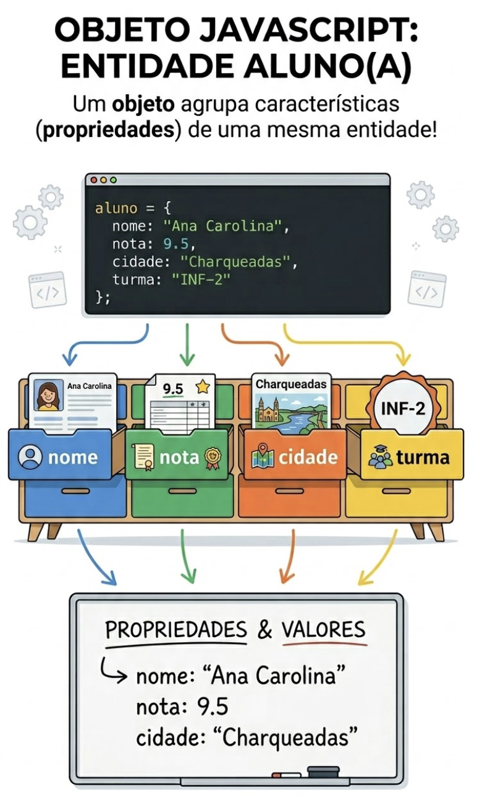
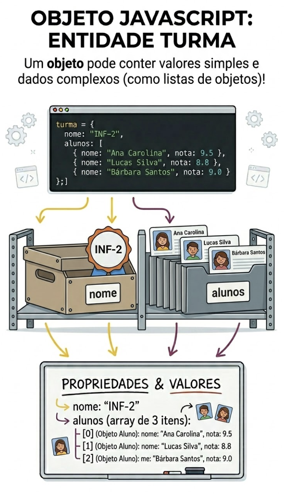

<!-- _class: lead -->

# Programação Web I
## Objetos em JavaScript

Prof. Pablo Werlang
pablowerlang@ifsul.edu.br

---

# Objetos em JavaScript
## Para que isso serve na prática?

<div class="grid grid-cols-3">
<div class="col-span-2">

- Representar uma entidade inteira com nome, nota, preço, cidade e o que mais fizer sentido
- Parar de espalhar variáveis soltas pelo código e organizar os dados de forma mais lógica
- Organizar dados para renderizar perfis, boletins, vitrines e agendas
- Preparar terreno para arrays de objetos, DOM e APIs

</div>
<div class="media flex size-full justify-end">
    
</div>
</div>

---

# Objetos em JavaScript
## Roteiro da aula

- O que é um objeto e quando ele faz mais sentido que um array
- Criação, acesso, atualização e remoção de propriedades
- Leitura de chaves e valores com `keys`, `values` e `entries`
- Combinação com arrays para modelar dados reais
- Percurso, filtro e transformação em arrays de objetos
- Aplicações no DOM e exercícios da seção

---

<!-- _class: divider -->

# Conceito Base

---

# Objetos em JavaScript
## O que é um objeto?

```js
const aluno = {
    nome: 'Ana',
    nota: 8.5,
    turma: '2AT'
};
```

- Um objeto agrupa pares de **chave** e **valor**
- Cada propriedade descreve uma **característica da entidade**
- É ideal quando um valor sozinho já não conta a história toda
- Exemplo clássico: *aluno*, *produto*, *contato*, *filme*, *tarefa*

---

# Objetos em JavaScript
## Array ou objeto?

<div class="grid grid-cols-2 gap-6 h-full">
<div>

**Array**

```js
const alunos = ['Ana', 'Bruno', 'Carla'];
```

- Foco em coleção
- A posição importa
- Bom para listas

</div>
<div>

**Objeto**

```js
const aluno = {
    nome: 'Ana',
    nota: 8.5,
    cidade: 'Charqueadas'
};
```

- Foco em atributos
- A chave importa
- Bom para descrever uma entidade

</div>
</div>

---

# Objetos em JavaScript
## Criando objetos

<div class="grid grid-cols-2 gap-6 h-full">
<div>

**Objeto literal**

```js
const produto = {
    nome: 'Caderno',
    preco: 18.9,
    estoque: 12
};
```

</div>
<div>

**Objeto vazio**

```js
const usuario = {};

usuario.nome = 'Marina';
usuario.idade = 17;
```

</div>
</div>

- Literal é o caminho mais comum
- Objeto vazio aparece quando os dados chegam depois

---

# Objetos em JavaScript
## Acessando propriedades

<div class="grid grid-cols-2 gap-6 h-full">
<div>

**Notação com ponto**

```js
const filme = {
    titulo: 'Wall-E',
    ano: 2008
};

console.log(filme.titulo);
```

- Mais comum
- Melhor quando a chave já é conhecida

</div>
<div>

**Notação com colchetes**

```js
const chave = 'ano';

console.log(filme[chave]);
console.log(filme['titulo']);
```

- Útil quando a chave vem de variável
- Também funciona com string literal

</div>
</div>

---

# Objetos em JavaScript
## Alterar, adicionar e remover

```js
const aluno = {
    nome: 'Ana',
    nota: 8,
    cidade: 'São Jerônimo'
};

aluno.nota = 9;
aluno.bolsista = true;
delete aluno.cidade;
```

- Reatribuir muda um valor existente
- Escrever uma chave nova adiciona propriedade
- `delete` remove uma propriedade do objeto

---

# Objetos em JavaScript
## `keys`, `values` e `entries`

```js
const aluno = {
    nome: 'Ana',
    nota: 8.5,
    turma: '2AT'
};

console.log(Object.keys(aluno)); // ['nome', 'nota', 'turma']
console.log(Object.values(aluno)); // ['Ana', 8.5, '2AT']
console.log(Object.entries(aluno)); // [['nome', 'Ana'], ['nota', 8.5], ['turma', '2AT']]
```

- `keys()` lista as chaves do objeto
- `values()` devolve só os valores
- `entries()` traz pares `[chave, valor]`, ótimo para percorrer tudo

---

<!-- _class: divider -->

# Modelando Dados Reais

---

# Objetos em JavaScript
## Objetos com arrays

<div class="grid grid-cols-3 gap-6 h-full">
<div class="col-span-2">

```js
const turma = {
    nome: '2AT',
    alunos: ['Ana', 'Bruno', 'Carla']
};
```

- O objeto descreve a turma
- A propriedade `alunos` guarda uma coleção
- Esse casamento aparece o tempo todo em sistemas reais

</div>
<div class="flex size-full media mx-auto justify-end">
    
</div>
</div>

---

# Objetos em JavaScript
## Arrays de objetos

```js
const alunos = [
    { nome: 'Ana', nota: 8 },
    { nome: 'Bruno', nota: 6 },
    { nome: 'Carla', nota: 9 }
];
```

- Cada item da lista é uma entidade completa
- Esse formato alimenta tabelas, cards, buscas e relatórios
- Quase toda API moderna devolve dados assim

---

# Objetos em JavaScript
## Percorrendo arrays de objetos

```js
const alunos = [
    { nome: 'Ana', nota: 8 },
    { nome: 'Bruno', nota: 6 },
    { nome: 'Carla', nota: 9 }
];

alunos.forEach((aluno) => {
    console.log(aluno.nome, aluno.nota);
});
```

- O array cuida da lista
- O objeto guarda os atributos de cada item
- Esse padrão é a ponte entre dados e interface

---

# Objetos em JavaScript
## Filtrar, transformar e resumir

**`filter()`**: filtra itens com base em condição

```js
const aprovados = alunos.filter( (aluno) => aluno.nota >= 7 );
```

**`map()`**: transforma cada item em algo novo

```js
const nomes = alunos.map( (aluno) => aluno.nome );
```

**`reduce()`**: reduz a lista a um valor só

```js
const soma = alunos.reduce( (total, aluno) => total + aluno.nota, 0 );
```

---

# Objetos em JavaScript
## Objetos e DOM

```js
function renderAluno(aluno) {
    const saida = document.querySelector('#saida');
    saida.textContent = `${aluno.nome} - Nota: ${aluno.nota}`;
}

const aluno = { nome: 'Ana', nota: 8.5 };
renderAluno(aluno);
```

- A tela normalmente exibe propriedades do objeto
- Atualizar o objeto costuma ser o primeiro passo para atualizar a interface
- Depois, com arrays de objetos, dá para montar listas inteiras no DOM

---

<!-- _class: divider -->

# Erros Comuns

---

# Objetos em JavaScript
## Erros comuns

<div class="grid grid-cols-2 gap-6 h-full">
<div>

**Confundir array com objeto**

- Objeto não se organiza por índice

```js
const aluno = { nome: 'Ana' };
console.log(aluno[0]); // undefined
```

</div>
<div>

**Acessar chave inexistente**

- Se a propriedade não existe, o retorno é `undefined`
- Vale conferir nomes e estrutura antes de usar

```js
console.log(aluno.idade); // undefined
```

</div>
</div>

---

# Objetos em JavaScript
## Erros comuns

<div class="grid grid-cols-2 gap-6 h-full">
<div>

**Renderizar Objetos**

- O DOM não sabe mostrar um objeto inteiro
- É preciso acessar as propriedades específicas para exibir algo legível

```js
const saida = document.querySelector('#saida');
saida.textContent = aluno; // [object Object]
```

</div>
<div>

**Atualizar o DOM sem uma lógica de renderização**

- Mudar o objeto não muda a tela automaticamente
- Evite atualizar o DOM em vários lugares do código
- Centralize isso em uma função de renderização que lê o estado atual do objeto e reescreve a interface

</div>
</div>

---

<!-- _class: divider -->

# Exercícios

---

# Objetos em JavaScript
## Exercício: Perfil de aluno

- Representar um único aluno com um objeto principal
- Atualizar nome, turma, cidade, idade e bolsa a partir do formulário
- Exibir a tela como consequência do estado atual do objeto
- Bom para fixar objeto literal, notação de ponto e atualização de propriedades

- [Veja um exemplo de como pode ficar](https://werlang.github.io/pw1/03-objetos/perfil-aluno/)

---

# Objetos em JavaScript
## Exercício: Agenda de contatos

- Criar um array de objetos com nome, telefone e cidade
- Cadastrar contatos e listar os registros na tela
- Buscar por nome usando `filter()` e destacar o primeiro resultado com `find()`
- Excelente para mostrar por que texto solto vira bagunça rápido

- [Veja um exemplo de como pode ficar](https://werlang.github.io/pw1/03-objetos/agenda-contatos/)

---

# Objetos em JavaScript
## Exercício: Boletim

- Manter a turma em um array de objetos com `nome` e `nota`
- Atualizar a interface sempre que um novo aluno entrar
- Calcular média, aprovados e maior nota com os dados atuais
- Aqui `forEach()`, `filter()`, `map()` e `reduce()` aparecem trabalhando juntos

- [Veja um exemplo de como pode ficar](https://werlang.github.io/pw1/03-objetos/boletim/)

---

# Objetos em JavaScript
## Exercício: Vitrine de produtos

- Modelar produtos com nome, categoria e preço
- Renderizar cards a partir do array principal
- Resumir quantidade, preço médio e produto mais caro
- Ótimo exemplo de dados estruturados alimentando interface e cálculos

- [Veja um exemplo de como pode ficar](https://werlang.github.io/pw1/03-objetos/vitrine-produtos/)