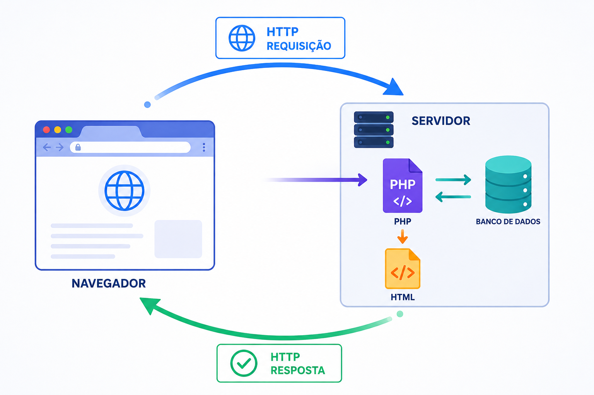

<!-- _class: lead -->

# Programação Web I
## Linguagem PHP e Funções

Prof. Pablo Werlang
pablowerlang@ifsul.edu.br

---

# Linguagem PHP
## O navegador pede, o servidor responde

<div class="grid grid-cols-2 gap-6 h-full">
<div>

- JavaScript cuida da interação no navegador
- PHP executa no servidor
- O back-end valida regras e acessa dados
- A resposta pode ser HTML, texto ou JSON

</div>
<div class="media mx-auto">
    
</div>
</div>

---

# Linguagem PHP
## O caminho de uma requisição

1. O navegador envia uma requisição HTTP
2. O servidor entrega a requisição ao PHP
3. O PHP valida e processa os dados
4. Arquivos ou banco podem participar
5. O servidor devolve a resposta

**O navegador recebe o resultado, não o código-fonte PHP.**

---

# Linguagem PHP
## Front-end e back-end

<div class="grid grid-cols-2 gap-6">
<div>

**JavaScript no navegador**

- reage a eventos
- manipula o DOM
- envia requisições
- não deve guardar segredos

</div>
<div>

**PHP no servidor**

- recebe requisições
- valida dados novamente
- aplica regras de negócio
- acessa dados protegidos

</div>
</div>

---

<!-- _class: divider -->

# Primeiros passos

---

# Linguagem PHP
## O ambiente necessário

- Um `.php` precisa passar pelo interpretador
- Apache recebe a requisição
- PHP executa o script

---

# Linguagem PHP
## Primeiro script

```php
<?php

echo "Olá, turma!";
```

- O código começa com `<?php`
- Instruções terminam normalmente com `;`
- `echo` escreve na resposta
- Em arquivo só de PHP, podemos omitir `?>`

---

# Linguagem PHP
## PHP e HTML no mesmo arquivo

```php
<?php
$nome = "Ana";
?>

<h1>Olá, <?= $nome ?></h1>
```

- `<?= ... ?>` é a forma curta de `echo`
- PHP prepara os valores
- HTML organiza a apresentação

---

# Linguagem PHP
## Variáveis e tipos

```php
$nome = "Bruna";       // string
$idade = 17;           // int
$media = 8.5;          // float
$matriculado = true;   // bool
$observacao = null;    // null
```

- Toda variável começa com `$`
- O tipo pode mudar durante a execução
- O tipo ainda define quais operações fazem sentido

---

# Linguagem PHP
## Strings: ponto não é detalhe

```php
$curso = "Informática";
$turma = "2AT";

echo $curso . " - " . $turma;
echo "$curso - $turma";
```

- `.` concatena textos
- Aspas duplas permitem interpolação
- `+` continua sendo operador numérico

---

# Linguagem PHP
## Operadores essenciais

<div class="grid grid-cols-3 gap-6">
<div>

**Cálculo**

`+ - * / %`

</div>
<div>

**Comparação**

`=== !== > >= < <=`

</div>
<div>

**Lógica**

`&& || !`

</div>
</div>

Prefira comparação estrita quando o tipo fizer parte da regra.

---

<!-- _class: divider -->

# Controle do programa

---

# Linguagem PHP
## Decisões com `if`

```php
if ($media >= 7) {
    $situacao = "Aprovado";
} elseif ($media >= 5) {
    $situacao = "Recuperação";
} else {
    $situacao = "Reprovado";
}
```

- As condições são avaliadas em ordem
- Apenas o primeiro bloco compatível executa
- Operadores lógicos combinam regras

---

# Linguagem PHP
## Qual repetição escolher?

<div class="grid grid-cols-3 gap-6">
<div>

**`while`**

Enquanto uma condição continuar verdadeira.

</div>
<div>

**`do...while`**

Executa ao menos uma vez.

</div>
<div>

**`for`**

Quando existe um contador previsível.

</div>
</div>

---

# Linguagem PHP
## Tabuada sem copiar dez vezes

```php
for ($numero = 1; $numero <= 10; $numero++) {
    $resultado = 7 * $numero;
    echo "<p>7 × $numero = $resultado</p>";
}
```

1. inicializa o contador;
2. testa a condição;
3. executa o bloco;
4. atualiza o contador.

---

# Linguagem PHP
## Gerando HTML com um laço

```php
<ul>
    <?php for ($numero = 1; $numero <= 6; $numero++) { ?>
        <li>Crachá <?= $numero ?></li>
    <?php } ?>
</ul>
```

- O laço fornece os valores
- O HTML define a estrutura visual
- Arrays entram na próxima seção

---

# Linguagem PHP
## `include` e `require`

| Comando | Arquivo ausente | Repete? |
| :--- | :--- | :--- |
| `include` | avisa e continua | sim |
| `require` | interrompe | sim |
| `include_once` | avisa e continua | não |
| `require_once` | interrompe | não |

```php
require_once __DIR__ . "/config.php";
```

---

<!-- _class: divider -->

# Funções

---

# Funções no PHP
## Um bloco com nome e responsabilidade

```php
function somar($numeroA, $numeroB) {
    return $numeroA + $numeroB;
}

$resultado = somar(10, 20);
```

- **Parâmetros:** variáveis da definição
- **Argumentos:** valores usados na chamada
- **Retorno:** resultado entregue por `return`

---

# Funções no PHP
## `return` não é `echo`

<div class="grid grid-cols-2 gap-6">
<div>

**`return`**

- entrega um valor a quem chamou a função;
- encerra a função;
- permite decidir depois como exibir o resultado.

</div>
<div>

**`echo`**

- escreve imediatamente na resposta HTTP;
- não entrega o resultado para outra parte do programa;
- deve ficar perto da camada de saída.

</div>
</div>

---

# Funções no PHP
## Valores padrão e tipos

```php
function calcularMedia( float $notaA, float $notaB, float $bonus = 0 ): float {
    return ($notaA + $notaB) / 2 + $bonus;
}
```

- O valor padrão torna um argumento opcional
- O tipo pode ser indicado antes do parâmetro
- O tipo de retorno pode ser indicado depois dos parênteses
- Dados recebidos de formulários ainda precisam ser validados

---

# Funções no PHP
## Retorno antecipado deixa a regra clara

```php
function calcularDesconto($preco) {
    if ($preco <= 0) {
        return 0;
    }

    return $preco * 0.1;
}
```

- Casos inválidos terminam logo no início
- O caminho principal fica menos aninhado
- A função continua entregando um valor previsível

---

# Funções no PHP
## Escopo local e dependências

<div class="grid grid-cols-2 gap-6">
<div>

**Dependência escondida**

```php
function calcularTotal($preco) {
    global $taxa;
    return $preco * (1 + $taxa);
}
```

</div>
<div>

**Dependência explícita**

```php
function calcularTotal($preco, $taxa) {
    return $preco * (1 + $taxa);
}
```

</div>
</div>

Prefira parâmetros: eles deixam claro do que a função precisa.

---

# Funções no PHP
## Variável `static`

```php
function proximoNumero() {
    static $contador = 0;
    $contador++;
    return $contador;
}

echo proximoNumero(); // 1
echo proximoNumero(); // 2
```

`static` preserva o valor entre chamadas da função durante a requisição atual. Ele não é global: não pode ser acessado fora da função.

---

# Funções no PHP
## Funções anônimas e arrow functions

<div class="grid grid-cols-2 gap-6">
<div>

```php
$dobro = function ($numero) {
    return $numero * 2;
};
```

</div>
<div>

```php
$triplo = fn($numero) =>
    $numero * 3;
```

</div>
</div>

- Podem ser armazenadas em variáveis e passadas como valores
- São úteis para callbacks e transformações curtas
- Regras maiores pedem uma função nomeada

---

# Funções no PHP
## Callback: uma função recebe outra

```php
function aplicarOperacao( $numero, $operacao ) {
    return $operacao($numero);
}

$dobro = fn($numero) => $numero * 2;
echo aplicarOperacao(6, $dobro); // 12
```

- O callback define qual operação será aplicada
- Primeiro, domine funções nomeadas e parâmetros comuns

---

# Funções no PHP
## Uma responsabilidade por vez

- Use um nome que expresse uma ação
- Receba dependências por parâmetros
- Retorne resultados de cálculo ou validação
- Não misture formulário, banco e HTML no mesmo bloco
- Se a função ficou difícil de explicar, divida a responsabilidade

---

<!-- _class: divider -->

# Hora de praticar

---

# Linguagem PHP e Funções
## Prática: cálculo e regras

- **Painel de Consumo de Água:** extraia cálculos e classificação para funções<br>
  `06-php-linguagem/painel-consumo-agua/`
- **Bilheteria da Gincana:** faça uma função receber as regras do ingresso<br>
  `06-php-linguagem/bilheteria-gincana/`
- **Calendário de Treinos:** isole as regras de dia especial e fim de semana<br>
  `06-php-linguagem/calendario-treinos/`

Cada exercício começa com uma regra clara e a transforma em funções pequenas.

---

# Linguagem PHP e Funções
## Prática: repetição e estado

- **Lote de Crachás Numerados:** separe a formatação do código da geração do lote<br>
  `06-php-linguagem/crachas-numerados/`
- **Simulação do Reservatório:** faça uma função descrever cada rodada<br>
  `06-php-linguagem/reservatorio-escola/`

Sem arrays ou formulários: as funções próprias já fazem parte desta aula.

---

# Linguagem PHP
## Erros que aparecem cedo

- Abrir `.php` sem passar pelo servidor
- Esquecer `$`, `;` ou usar `+` para texto
- Comparar tipos diferentes sem perceber
- Criar laço sem condição de parada
- Usar `global` quando o valor pode ser parâmetro
- Usar `echo` quando a regra precisa devolver um resultado
- Misturar cálculo e marcação até perder a leitura
- Confiar somente na validação do navegador

---

# Linguagem PHP e Funções
## O que precisa ficar

- PHP executa no servidor e produz uma resposta
- Variáveis e operadores representam os dados
- Decisões escolhem caminhos
- Laços geram repetições previsíveis
- HTML apresenta os valores calculados
- `require` inclui arquivos indispensáveis
- Funções recebem argumentos e devolvem resultados
- Escopo e parâmetros mantêm as dependências visíveis
