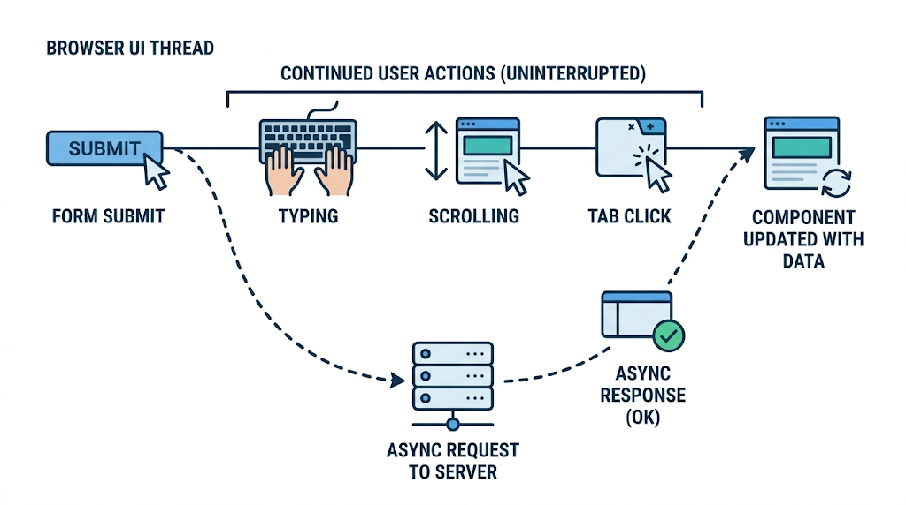

<!-- _class: lead -->

# Programação Web I
## AJAX e JavaScript Assíncrono

Prof. Pablo Werlang
pablowerlang@ifsul.edu.br

---

# JavaScript Assíncrono
## Esperar sem congelar o navegador

- O JavaScript executa em linha única (*single thread*)
- Tarefas de rede e temporizadores rodam em segundo plano nos bastidores
- A interface continua responsiva para digitação, rolagem e cliques
- Quando a resposta fica pronta, o JavaScript reage e atualiza o DOM

<div class="media mx-auto flex items-center justify-center">
    
</div>

---

# JavaScript Assíncrono
## Síncrono vs. Assíncrono

<div class="grid grid-cols-2 gap-6">
<div>

**Execução Síncrona (Bloqueante)**

- Uma instrução só inicia após a anterior terminar
- Segue ordem linear e rígida
- Se algo demorar, tudo ao redor fica paralisado

</div>
<div>

**Execução Assíncrona (Não Bloqueante)**

- Tarefas demoradas são agendadas
- O navegador continua atendendo o usuário
- O resultado é processado quando estiver pronto

</div>
</div>

<!-- <div class="media mx-auto">
    
</div> -->

---

# JavaScript Assíncrono
## A ordem de execução pode surpreender

```js
console.log('A');

setTimeout(function() {
    console.log('B');
}, 1000);

console.log('C');
```

**Saída no console:** `A`, `C`, `B`.

- O código não "dorme" por 1 segundo na linha do temporizador
- A função com `B` é apenas agendada para daqui a pouco
- A execução principal avança de imediato e imprime `C`

---

# JavaScript Assíncrono
## Callback: uma função para executar depois

```js
function avisarConclusao() {
    console.log('Tarefa concluída!');
}

setTimeout(avisarConclusao, 1000);
```

- Callback é uma função passada como argumento para ser chamada no futuro
- Você já usa callbacks nos eventos do DOM:
  `botao.addEventListener('click', aoClicar);`
- No clique, quem avisa é o usuário; no temporizador, quem avisa é o relógio

---

<!-- _class: divider -->

# Temporizadores no Navegador

---

# Temporizadores
## setTimeout(): agendamento de disparo único

```js
const id = setTimeout(function() {
    mensagem.textContent = 'Aviso exibido após 2 segundos';
}, 2000);

// Para cancelar o agendamento antes do disparo:
clearTimeout(id);
```

- O tempo é sempre informado em milissegundos (`1000 ms = 1 s`)
- A função é executada apenas uma vez
- `clearTimeout(id)` cancela a ação se chamado a tempo
- Ideal para esconder notificações temporárias (*toast*) e criar pausas

---

# Temporizadores
## setInterval(): repetição periódica

```js
const id = setInterval(function() {
    console.log('Atualização a cada 1 segundo');
}, 1000);

// Para interromper a repetição:
clearInterval(id);
```

- Dispara a função repetidamente no intervalo estipulado
- Retorna um identificador numérico que você deve guardar em variável
- Sem guardar o `id`, você perde o controle e não consegue parar a repetição

---

# Temporizadores
## O perigo do intervalo duplicado

```js
let intervalo = null;

function iniciar() {
    if (intervalo !== null) return; // Já está rodando, não duplica!

    intervalo = setInterval(atualizar, 100);
}

function pausar() {
    clearInterval(intervalo);
    intervalo = null; // Libera para poder iniciar de novo
}
```

- Cada clique em "Iniciar" sem trava cria um novo loop concorrente
- Múltiplos intervalos deixam o contador acelerado e instável
- O estado `null` sinaliza com clareza quando não há loop ativo

---

# Temporizadores
## O intervalo atualiza; o relógio mede

```js
const inicio = Date.now();

setInterval(function() {
    const decorrido = Date.now() - inicio;
    mostrador.textContent = (decorrido / 1000).toFixed(1);
}, 100);
```

- O tempo informado no temporizador é um atraso mínimo, não exato
- Se o navegador estiver ocupado, somar `+0.1` a cada ciclo acumula erro
- Para cronômetros confiáveis, calcule o delta real com `Date.now()` ou `performance.now()`

---

<!-- _class: divider -->

# Promises e Funções Assíncronas

---

# Promises
## A promessa de um resultado futuro

<div class="grid grid-cols-3 gap-6">
<div>

**pending**

Aguardando. A operação ainda está sendo executada nos bastidores.

</div>
<div>

**fulfilled**

Resolvida com sucesso. O resultado esperado está pronto e disponível.

</div>
<div>

**rejected**

Rejeitada. Ocorreu uma falha ou impedimento na execução.

</div>
</div>

<!-- <div class="media mx-auto">
    
</div> -->

---

# Promises
## Encadeando com .then() e .catch()

```js
fetch('api/status.php')
    .then((response) => {
        return response.json();
    })
    .then((dados) => {
        console.log('Sucesso:', dados);
    })
    .catch((erro) => {
        console.error('Falha na operação:', erro.message);
    });
```

- Cada `.then()` processa a resposta entregue pelo passo anterior
- O `.catch()` captura falhas que ocorrerem em qualquer ponto da cadeia
- Funciona bem, mas cadeias longas tornam o fluxo mais difícil de ler

---

# Funções Assíncronas
## A clareza de async e await

```js
async function carregarStatus() {
    try {
        const response = await fetch('api/status.php');
        const dados = await response.json();
        console.log('Status recebido:', dados);
    } catch (erro) {
        console.error('Erro na requisição:', erro.message);
    }
}
```

- `async` declara que a função lida com tarefas assíncronas e retorna uma Promise
- `await` pausa a leitura interna da função até a Promise terminar
- O código é lido de cima para baixo como se fosse síncrono, sem travar o navegador

---

<!-- _class: divider -->

# AJAX com a API fetch()

---

# AJAX
## A grande virada na experiência da Web

<div class="grid grid-cols-2 gap-6">
<div>

**Web Tradicional (sem AJAX)**

- O formulário envia dados ao servidor
- A página inteira pisca em branco e recarrega
- O servidor gera e devolve um novo HTML completo
- O usuário perde o estado local e a rolagem

</div>
<div>

**Web Moderna (com AJAX)**

- O JavaScript intercepta o envio em segundo plano
- A página nunca é recarregada
- O servidor devolve apenas dados puros (JSON)
- O DOM atualiza cirurgicamente apenas o necessário

</div>
</div>

<!-- <div class="media mx-auto">
    
</div> -->

---

# AJAX
## Anatomia do fetch(): por que usamos dois awaits?

```js
// 1. Aguarda os cabeçalhos e status HTTP chegarem:
const response = await fetch('api/alunos.php');

// 2. Faz o download do corpo e converte o texto JSON em objeto:
const dados = await response.json();
```

- `fetch()` inicia a requisição HTTP e retorna um objeto `Response`
- No primeiro passo, você já tem acesso ao status (`200`, `404`) e cabeçalhos
- O corpo da resposta pode ser pesado e chega em fluxo de dados
- Ler e decodificar o corpo com `response.json()` também é assíncrono

---

# AJAX
## A armadilha: 404 e 500 não caem no catch

```js
const response = await fetch('api/alunos.php');

if (!response.ok) {
    // Status fora da faixa 200-299 (ex.: 404, 500)
    throw new Error(`Falha na resposta HTTP: ${response.status}`);
}

const dados = await response.json();
```

- `fetch()` só rejeita a Promise por falha de rede (sem internet, DNS inacessível)
- Um status `404 Not Found` é uma resposta que chegou ao navegador com sucesso!
- Sempre valide `response.ok` antes de continuar o processamento

---

# AJAX
## Tratamento robusto com try...catch

```js
async function carregarLista() {
    mensagem.textContent = 'Carregando dados...';

    try {
        const response = await fetch('api/alunos.php');
        const dados = await response.json();

        if (!response.ok) throw new Error(dados.message || 'Falha no servidor');

        renderizarAlunos(dados.alunos);
        mensagem.textContent = 'Lista carregada!';
    } catch (erro) {
        mensagem.textContent = erro.message;
    }
}
```

- Unifica o tratamento de quedas de conexão e erros de validação da API
- A interface sempre fornece retorno visual para o usuário

---

<!-- _class: divider -->

# Enviando Dados ao Servidor

---

# Enviando Dados
## Consulta GET com URLSearchParams

```js
const parametros = new URLSearchParams({
    turma: '2AT',
    ordem: 'nome'
});

// Monta a URL: api/alunos.php?turma=2AT&ordem=nome
const response = await fetch(`api/alunos.php?${parametros}`);
const dados = await response.json();
```

- Evita concatenar interrogações (`?`) e caracteres especiais na mão
- Trata espaços e acentuação de forma segura na URL
- No PHP, esses parâmetros chegam normalmente pelo array `$_GET`

---

# Enviando Dados
## POST com FormData: ideal para formulários

```js
formulario.addEventListener('submit', async function(evento) {
    evento.preventDefault(); // Impede o recarregamento da página!

    const response = await fetch('api/cadastro.php', {
        method: 'POST',
        body: new FormData(formulario)
    });
    const resultado = await response.json();
});
```

- `new FormData(formulario)` coleta todos os `<input name="...">` automaticamente
- **Regra de ouro:** NUNCA configure o cabeçalho `Content-Type` manualmente aqui!
- O navegador adiciona o `multipart/form-data` com o separador correto
- No PHP, os campos chegam diretamente em `$_POST` (e arquivos em `$_FILES`)

---

# Enviando Dados
## POST com JSON: quando a API exige objeto puro

```js
const aluno = { nome: 'Ana Souza', turma: '2AT' };

await fetch('api/alunos.php', {
    method: 'POST',
    headers: {
        'Content-Type': 'application/json'
    },
    body: JSON.stringify(aluno)
});
```

- Exige avisar o servidor via cabeçalho: `'Content-Type': 'application/json'`
- O objeto JavaScript precisa ser convertido em texto com `JSON.stringify()`
- **No PHP:** `$_POST` fica vazio! O JSON bruto deve ser lido com:
  `$dados = json_decode(file_get_contents("php://input"), true);`

---

# Enviando Dados
## Resumo dos formatos de envio

| Formato | Construção no JavaScript | Cabeçalho Content-Type | Leitura no PHP |
| :--- | :--- | :--- | :--- |
| **GET** | `URLSearchParams` na URL | *(Sem corpo)* | `$_GET["campo"]` |
| **FormData** | `new FormData(form)` no corpo | *(Automático)* | `$_POST["campo"]` |
| **JSON** | `JSON.stringify()` no corpo | `'application/json'` | `php://input` |

- Para os formulários e rotinas da disciplina, `FormData` é o formato padrão
- JSON no corpo é comum quando consumimos APIs RESTful completas

---

<!-- _class: divider -->

# O Backend em PHP e Status HTTP

---

# Backend em PHP
## Resposta padronizada e defensiva

```php
<?php
header("Content-Type: application/json; charset=utf-8");

$nome = trim($_POST["nome"] ?? "");

if ($nome === "") {
    http_response_code(400); // Bad Request
    echo json_encode(["error" => true, "message" => "O nome é obrigatório"]);
    exit; // Interrompe a execução imediatamente!
}

http_response_code(201); // Created
echo json_encode(["nome" => $nome, "message" => "Cadastro realizado"]);
```

- Cabeçalho informa ao navegador que a resposta é JSON puro
- `exit;` impede que saídas acidentais corrompam o formato JSON
- Estrutura clara: `error` presente apenas quando a validação falhar

---

# Backend em PHP
## O status classifica; o JSON explica

| Status HTTP | Nome | Quando utilizar no backend |
| :--- | :--- | :--- |
| `200` | OK | Leitura concluída ou atualização realizada |
| `201` | Created | Novo registro gravado com sucesso |
| `400` | Bad Request | Requisição incompleta ou malformada |
| `404` | Not Found | Recurso ou registro procurado não existe |
| `500` | Server Error | Falha inesperada no script ou no banco |

- O código numérico permite ao JavaScript tomar decisões de fluxo
- O texto do JSON traz a explicação legível para o usuário final

---

<!-- _class: divider -->

# Experiência de Usuário e Fluxos Reais

---

# Interface e Assincronismo
## O ciclo dos quatro estados

```js
botao.disabled = true;
mensagem.textContent = 'Enviando dados...';

try {
    await enviarFormulario();
    mensagem.textContent = 'Operação realizada com sucesso!';
} catch (erro) {
    mensagem.textContent = erro.message;
} finally {
    botao.disabled = false; // Executa SEMPRE: tanto no sucesso quanto no erro!
}
```

- Desabilitar o botão impede envios acidentais duplicados por duplo clique
- O bloco `finally` garante que o botão destrave mesmo se houver erro
- A interface nunca deve parecer travada ou sem retorno ao usuário

---

# Interface e Assincronismo
## Polling: atualizações periódicas sem sobreposição

```js
async function monitorarSensores() {
    try {
        await atualizarLeituras();
    } finally {
        // Agenda a próxima leitura somente DEPOIS que a anterior terminar!
        setTimeout(monitorarSensores, 5000);
    }
}

monitorarSensores();
```

- Com `setInterval`, se uma requisição demorar 6s, elas começam a se atropelar na rede
- Agendar o próximo `setTimeout` no `finally` garante um intervalo de descanso real

---

# Interface e Assincronismo
## Busca rápida e AbortController

```js
let controlador = null;

function buscarNoAcervo(termo) {
    if (controlador) controlador.abort(); // Cancela a busca anterior!
    controlador = new AbortController();

    fetch(`api/busca.php?q=${termo}`, { signal: controlador.signal })
        .then(res => res.json())
        .then(renderizarResultados)
        .catch(erro => { if (erro.name !== 'AbortError') throw erro; });
}
```

- Em campos de busca com digitação rápida, uma resposta antiga pode chegar depois da nova
- `AbortController` cancela requisições obsoletas e evita resultados fora de ordem

---

# Segurança e Rede
## Origem e a política de CORS

- **Mesma Origem:** mesmo protocolo (`http`), mesmo domínio (`site.com`) e mesma porta (`80`)
- **CORS (*Cross-Origin Resource Sharing*):**
  - É uma trava de segurança imposta pelo **navegador**
  - Bloqueia scripts de ler respostas vindas de origens diferentes sem autorização prévia
- O servidor de destino precisa liberar expressamente a origem em seus cabeçalhos
- **Importante:** CORS é regra de proteção do navegador; não substitui login nem protege sua API contra ferramentas externas

---

<!-- _class: divider -->

# Exemplos e Exercícios

---

# Exemplos de Aula
## Códigos de referência no repositório

<div class="grid grid-cols-2 gap-6">
<div>

**Temporizador e Estado**

- Demonstra `setInterval()`, `clearInterval()` e animação de texto no botão
- Ensina a travar e liberar o botão durante o ciclo
- Pasta: `exemplos/ex09.1/`

</div>
<div>

**Cadastro com fetch() e Toast**

- Intercepta `submit` com `e.preventDefault()`
- Envia `FormData` e processa JSON no backend PHP
- Notificação temporária de sucesso ou erro
- Pasta: `exemplos/ex09.2/`

</div>
</div>

<!-- <div class="media mx-auto">
    
</div> -->

---

# Exercícios Práticos
## Sequência, debounce e envio

- **Painel de Largada:**
  Controle de prova de atletismo com contagem regressiva, atenção e largada. Pratica `esperar(ms)` com Promise, `async/await`, pausa e cancelamento sem abrir ciclos concorrentes.
  `09-php-ajax/painel-largada/`
- **Busca Cancelável no Acervo:**
  Consulta ágil em acervo escolar com digitação rápida. Implementa debounce e cancelamento via `AbortController` para que buscas antigas não sobrescrevam resultados recentes.
  `09-php-ajax/busca-acervo/`
- **Envio de Ocorrência:**
  Formulário com `FormData` via POST. Diferencia falha de rede de erro de validação (400) e sucesso (201), mantendo o formulário intacto durante falhas de preenchimento.
  `09-php-ajax/envio-ocorrencia/`

---

# Exercícios Práticos
## Linha do tempo e monitoramento

- **Rastreamento Simulado de Entrega:**
  Acompanhamento de pedido escolar em quatro etapas assíncronas. Trata falhas controladas, cancelamento e oferece "tentar novamente" retomando exatamente da etapa que falhou.
  `09-php-ajax/simulador-entrega/`
- **Monitor de Estações Meteorológicas:**
  Painel com atualização contínua de temperatura e umidade. Aplica polling sequencial seguro para não engavetar requisições, preserva a última leitura válida e alerta dados desatualizados.
  `09-php-ajax/monitor-estacoes/`

---

# AJAX e JavaScript Assíncrono
## Erros mais comuns (para você não cometer!)

<div class="grid grid-cols-2 gap-6">
<div>

- Esquecer `e.preventDefault()` no evento de `submit` (recarrega a página e mata o `fetch`)
- Esquecer o segundo `await` ao ler `response.json()`
- Achar que erros HTTP 404 e 500 caem automaticamente no `catch`

</div>
<div>

- Definir `Content-Type` na mão ao enviar `FormData`
- Iniciar novos intervalos no `setInterval` sem trava de estado `null`
- Travar o botão da interface desabilitado por esquecer de reabilitá-lo no `finally`

</div>
</div>

---

# AJAX e JavaScript Assíncrono
## O que precisa ficar

- **Assincronismo mantém a página viva:** tarefas demoradas rodam em segundo plano sem travar a interface
- **Promises e async/await:** trazem clareza e estrutura sequencial para operações futuras
- **fetch() atualiza sem recarregar:** troca dados com o servidor e atualiza apenas o pedaço necessário do DOM
- **Comunicação padronizada:** o status HTTP classifica a resposta; o JSON traz os dados e a mensagem
- **A interface faz parte do fluxo:** informe sempre se está carregando, se houve sucesso ou se ocorreu erro
